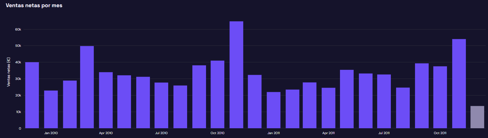

# Ecommerce Insights

Sube el fichero CSV de ventas de tu tienda online y obtén un dashboard, una segmentación de clientes
y una previsión de la demanda futura

**Demo en vivo:** (futuro enlace)



## Problema resuelto
Elimina horas de análisis manual en hojas de cálculo y aporta claridad financiera inmediata, facilitando a los responsables de negocio planificar el aprovisionamiento de catálogo con antelación y diseñar estrategias de fidelización personalizadas según el comportamiento real de compra.

## Funcionalidades
- Dashboard de ventas, ticket medio y top productos
- Segmentación de clientes (RFM + K-Means)
- Previsión de ventas con backtesting frente a una línea base

## Stack
Python, pandas, Streamlit, Plotly, scikit-learn, statsmodels

## Ejecución en local
```bash
python -m venv .venv
pip install -r requirements.txt
streamlit run app.py
```

## Datos y privacidad
Los archivos subidos se procesan en memoria y no se almacenan.


## Licencia 
MIT 